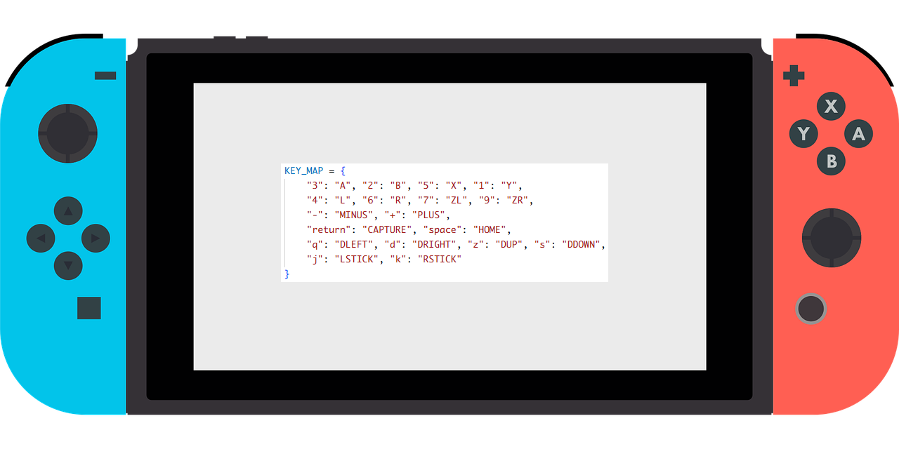

# NXMacro

A Nintendo Switch macro recorder and player via [sys-botbase](https://github.com/olliz0r/sys-botbase). Record button sequences from your keyboard and replay them on your Switch over TCP.

## Requirements

- Python 3.10+
- A Nintendo Switch running sys-botbase
- [`keyboard`](https://pypi.org/project/keyboard/) library (`pip install keyboard`)

> **Note:** The `keyboard` library requires root/administrator privileges on Linux and macOS.

## Installation

```bash
git clone https://github.com/ASauvage/nxmacro
cd nxmacro
pip install keyboard
```

## Usage

```bash
python -m nxmacro [-H HOST] [-p PORT] <command> [options]
```

### Global options

| Flag | Default | Description |
|------|---------|-------------|
| `-H`, `--host` | `192.168.1.1` | IP address of your Switch |
| `-p`, `--port` | `6000` | sys-botbase TCP port |

---

### `record` — Record a macro

```bash
python -m nxmacro record [-f macro.json]
```

1. Press **F9** to start recording.
2. Use the keyboard bindings below to send button inputs to the Switch in real time.
3. Press **F10** to stop and save the macro.

### `play` — Play back a macro

```bash
python -m nxmacro play [-f macro.json] [-l 1] [--speed 1.0]
```

| Flag | Default | Description |
|------|---------|-------------|
| `-f`, `--file` | `macro.json` | Macro file to play |
| `-l`, `--loop` | `1` | Number of repetitions (`0` = infinite) |

---

## Keyboard bindings



| Key | Switch button |
|-----|--------------|
| `1` | Y |
| `2` | B |
| `3` | A |
| `5` | X |
| `4` | L |
| `6` | R |
| `7` | ZL |
| `9` | ZR |
| `-` | MINUS |
| `+` | PLUS |
| `Z` | D-Up |
| `S` | D-Down |
| `Q` | D-Left |
| `D` | D-Right |
| `J` | L-Stick click |
| `K` | R-Stick click |
| `Space` | HOME |
| `Enter` | CAPTURE |

---

## Macro file format

Macros are stored as plain JSON and can be edited by hand.

```json
{
  "name": "unnamed",
  "created": "2025-01-01T00:00:00",
  "events": [
    { "timestamp": 0.0,   "action": "press",   "button": "A" },
    { "timestamp": 0.25,  "action": "release",  "button": "A" },
    { "timestamp": 1.0,   "action": "setStick", "stick": "LEFT", "x": 0, "y": 32767 }
  ]
}
```

**Button actions:** `press`, `release`, `click`  
**Stick actions:** `setStick` (with `x`, `y` in range `−32767..32767`)

---

## Project structure

```
nxmacro/
├── __main__.py     # Entry point
├── __init__.py
├── cli.py          # Argument parsing
├── actions.py      # record() and play() logic
├── bot.py          # High-level Switch API
├── connection.py   # TCP socket wrapper
├── macro.py        # Macro data model & serialisation
└── config.py       # Button list and key map
```
